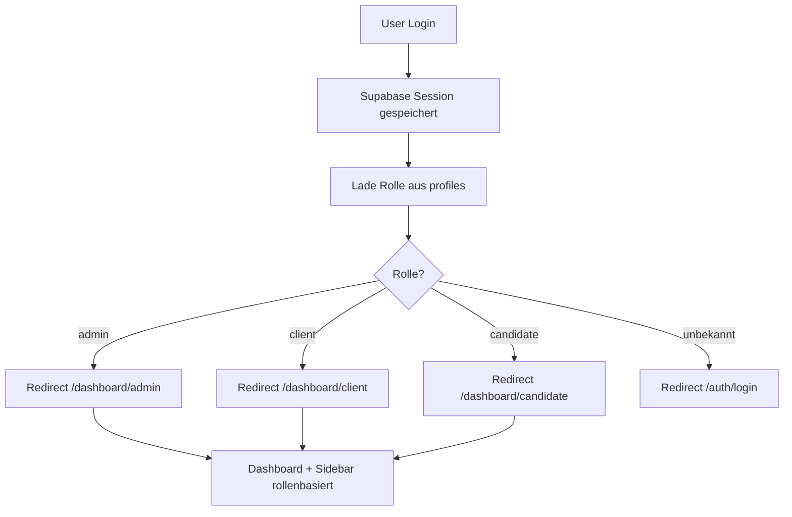

# Architekturübersicht (Stand: aktuell)

## Authentifizierung & Rollen
- **Supabase** wird als Authentifizierungs-Backend verwendet. Die Authentifizierung ist session-basiert (JWT im Cookie).
- Nach erfolgreichem Login wird die Rolle des Users aus der Tabelle `profiles` geladen. Die Tabelle ist wie folgt aufgebaut:
  - `id`: entspricht `auth.user.id` von Supabase
  - `role`: String, z.B. `admin`, `client`, `candidate`
- Die Rolle wird **clientseitig** nach dem Login geladen und im Context (`ProfileContext`) gespeichert. Sie steuert die Weiterleitung und das UI.
- Beispiel für das Laden der Rolle:
  ```ts
  // Pseudocode
  const { data: { user } } = await supabase.auth.getUser();
  const { data: profile } = await supabase.from('profiles').select('role').eq('id', user.id).single();
  ```
- Bekannte Rollen: `admin`, `client`, `candidate`. Neue Rollen können durch Hinzufügen in der Tabelle und im Code ergänzt werden.

## Login-Flow (Schritt für Schritt)
1. **User öffnet `/auth/login`** und meldet sich mit E-Mail/Passwort an (Supabase Auth).
2. Nach erfolgreichem Login wird die Session im Browser gespeichert (Cookie).
3. Die App lädt die Rolle des Users aus der Tabelle `profiles` (siehe oben).
4. Je nach Rolle erfolgt ein Redirect auf das jeweilige Dashboard:
   - `admin` → `/dashboard/admin`
   - `client` → `/dashboard/client`
   - `candidate` → `/dashboard/candidate`
5. Die Sidebar und das Dashboard-UI werden rollenbasiert gerendert.
6. Bei unbekannter oder fehlender Rolle erfolgt ein Redirect auf `/auth/login`.

## Routing & Zugriffsschutz
- **Alle geschützten Seiten liegen unter `/dashboard/`.**
- **Middleware (`middleware.ts`)** schützt alle `/dashboard`-Routen:
  - Prüft, ob eine gültige Supabase-Session existiert.
  - Bei fehlender Authentifizierung erfolgt ein Redirect auf `/auth/login`.
  - Beispiel (gekürzt):
    ```ts
    export async function middleware(request: NextRequest) {
      // ...
      const { data: { user } } = await supabase.auth.getUser();
      if (!user) {
        // Redirect zu Login
      }
      // ...
    }
    export const config = { matcher: ['/dashboard/:path*'] }
    ```
- Nach Login prüft die zentrale Datei `app/dashboard/page.tsx` die Rolle und leitet entsprechend weiter.
- Jede Rolle hat eine eigene Dashboard-URL und ggf. weitere Unterseiten (z.B. `/dashboard/admin/candidates`, `/dashboard/candidate/profile`).
- **Unberechtigte Zugriffe** (z.B. direkter Aufruf von `/dashboard/admin` ohne Session) werden durch die Middleware verhindert.

## Ordnerstruktur (relevant)
```
app/
  dashboard/
    page.tsx                  # Zentrale Routing-Komponente für Dashboards (leitet je nach Rolle weiter)
    admin/
      page.tsx                # Admin-spezifisches Dashboard
      candidates/
        page.tsx              # Kandidatenverwaltung für Admin
      users/                  # (optional) User Management für Admin
    client/
      page.tsx                # Client/Company-spezifisches Dashboard
      projects/               # (optional) Projekte für Client
    candidate/
      page.tsx                # Candidate-spezifisches Dashboard
      profile/
        page.tsx              # Profilseite für Kandidaten
    data/
      admin.json              # Beispiel-Daten für Admin
      company.json            # Beispiel-Daten für Company
      candidate.json          # Beispiel-Daten für Candidate
components/
  sidebar/
    nav-admin.ts              # Sidebar-Navigation für Admin (siehe unten)
    nav-client.ts             # Sidebar-Navigation für Client
    nav-candidate.ts          # Sidebar-Navigation für Candidate
  app-sidebar.tsx             # Haupt-Sidebar-Komponente, erhält Rolle/User als Prop
  nav-main.tsx                # Rendert die Hauptnavigation (rollenbasiert)
  nav-user.tsx                # User-Menü in der Sidebar
context/
  ProfileContext.tsx          # Context für User-Profile und Rolle
lib/
  supabase/
    client.ts                 # Supabase-Client für Client-seitige Requests
    middleware.ts             # Hilfsfunktionen für Middleware
middleware.ts                 # Next.js Middleware für Zugriffsschutz
```

## Sidebar-Logik (rollenbasiert)
- Die Sidebar wird über die Komponente `AppSidebar` gerendert und erhält die User-Daten und die Rolle als Prop.
- Je nach Rolle werden unterschiedliche Navigationspunkte angezeigt:
  - Die Navigationseinträge sind in `components/sidebar/nav-admin.ts`, `nav-client.ts`, `nav-candidate.ts` definiert.
  - Beispiel für Admin:
    ```ts
    export const navAdmin = [
      { title: "Dashboard", url: "/dashboard/admin", icon: IconDashboard },
      { title: "User Management", url: "/dashboard/admin/users", icon: IconUsers },
      { title: "Kandidatenverwaltung", url: "/dashboard/admin/candidates", icon: IconUsers },
    ];
    ```
- Die Sidebar ist vollständig dynamisch und kann durch Hinzufügen neuer Einträge in den jeweiligen Dateien erweitert werden.
- Die Sidebar-Komponenten nutzen die Next.js `usePathname`-Hook, um aktive Links hervorzuheben.

## Sicherheit (im Detail)
- **Clientseitig:**
  - Nach Login wird die Rolle geladen und im Context gespeichert.
  - Die zentrale Routing-Komponente (`app/dashboard/page.tsx`) prüft die Rolle und leitet weiter.
  - Die Sidebar und das UI werden nur für authentifizierte User und die jeweilige Rolle gerendert.
- **Serverseitig/Middleware:**
  - Die Middleware prüft für alle `/dashboard`-Routen, ob eine gültige Session existiert.
  - Ohne Session erfolgt ein Redirect auf `/auth/login`.
  - Unautorisierte Zugriffe auf geschützte Routen sind so nicht möglich.
- **Datenzugriff:**
  - API-Requests (z.B. zu Supabase) sollten immer die Session/JWT prüfen und ggf. serverseitig absichern.

## Erweiterbarkeit & Best Practices
- **Neue Rollen:**
  - In der Tabelle `profiles` anlegen und im Code (Sidebar, Routing) ergänzen.
  - Neue Dashboard-Seiten unter `app/dashboard/{role}/` anlegen.
- **Neue Dashboard-Bereiche:**
  - Einfach als neue Unterordner/Seiten unter dem jeweiligen Dashboard-Ordner anlegen (z.B. `/dashboard/admin/reports`).
  - Sidebar-Navigation in der jeweiligen Datei (`nav-admin.ts` etc.) ergänzen.
- **Neue geschützte Routen:**
  - Müssen unter `/dashboard/` liegen, damit die Middleware greift.
  - Bei Bedarf weitere Middleware-Checks (z.B. Rollenprüfung) ergänzen.
- **Onboarding für Entwickler:**
  - Die wichtigsten Einstiegspunkte sind `app/dashboard/page.tsx` (Routing), `middleware.ts` (Zugriffsschutz), und die Sidebar-Navigationen.
  - Für neue Features: immer prüfen, ob sie geschützt werden müssen und ob die Sidebar angepasst werden soll.

## Beispiel: Ablauf nach Login


---
Letztes Update: automatisch durch KI
